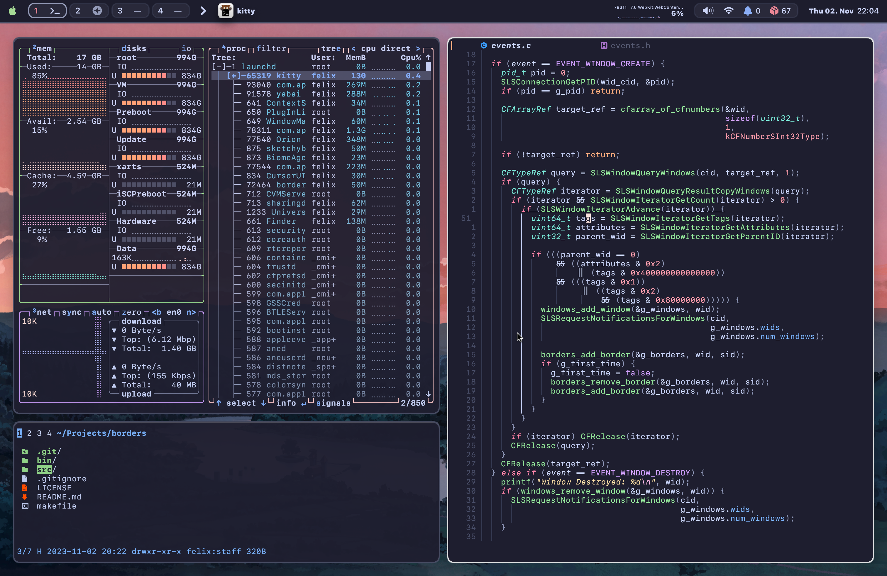

# JankyBorders



This small project adds colored borders to all user windows on macOS Sonoma and
later. It can be used to better identify the currently focused window. It does
not use the accessibility API and should thus be faster than comparable tools.

## Usage
Compile the source code to a binary using `make` in the cloned repository or
install the binary via brew:
```bash
brew tap FelixKratz/formulae
brew install borders
```

The binary can be started via `borders` and takes
any of the arguments (in arbitrary order and count):

* `active_color=<color_hex>`
* `inactive_color=<color_hex>`
* `width=<float>`
* `style=<style>`

Those determine the color of the currently focused window, the inactive window
and the width and style of the border respectively. The color hex shall be
given in the format: `0xAARRGGBB`, where `A` is the alpha channel, `R` the red
channel, `G` the green channel and `B` the blue channel. The `style` argument
is optional and can take the values `round` and `square`.

If a `borders` process is already running, invoking a new `borders` instance
with any combination of the above arguments will update the properties of the
already running instance (just like in yabai and sketchybar).

### Bootstrap with yabai
For example, if you are using `yabai`, you could add:
```bash
borders active_color=0xffe1e3e4 inactive_color=0xff494d64 width=5.0 2>/dev/null 1>&2 &
```
to the very end of your `yabairc`.

### Bootstrap with brew
If you want to run this as a separate service, you could also use:
```bash
brew services start borders
```

## Documentation
Local documentation is available as `man borders`.
