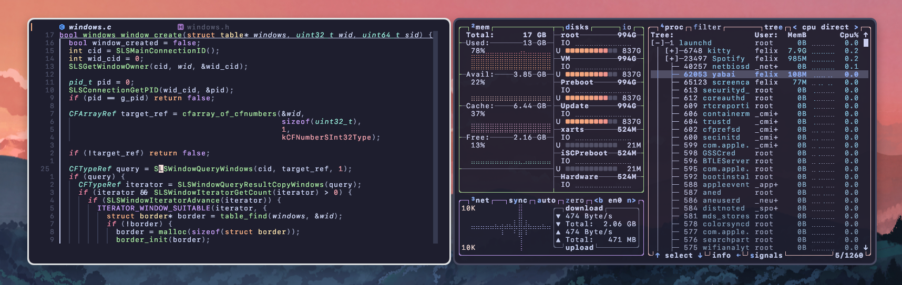

<h1 align="center">JankyBorders</h1>

<p align="center">

</p>
<p align="center">
<a href="https://github.com/slano-ls/JankyBorders/wiki">Documentation</a>
</p>

*JankyBorders* is a lightweight tool designed to add colored borders to user
windows on macOS 14.0+. It enhances the user experience by visually highlighting
the currently focused window without relying on the accessibility API, thereby
being faster than comparable tools.

---
## Manual Installation 
```bash 
git clone https://github.com/FelixKratz/JankyBorders
cd JankyBorders
make 
```

## Homebrew Installation 

```bash
brew tap FelixKratz/formulae
brew install borders
```

This will automatically make the command `borders {args}` usable in the terminal. 

---
## Regular Usage

To use borders, you can use the command `borders {args}` to initialize the program. 

## Bootstrapping with Brew
Another method that you can use is through the `brew services` method, with the following syntax

```bash 
brew services start borders
brew services restart borders
```

Upon startup, if `borders` is not started with any arguments (or launched as a service by brew), it will search for a file at launch located at `~/.config/borders/bordersrc` and will execute it on launch if found. 

---

## Basic Configuration 
The binary can be started via `borders` and can take any of the listed arguments in the `borders {args}` format. 

1. `active_color=<color>`
2. `inactive_color=<color>`
3. `width=<float>`
4. `style=<round/square>`
5. `hidpi=<off/on>`

For certain shells you may need to nest the arguments in quotations. 

If a `borders` process is already running, invoking a new `borders` instance with any combination of the above arguments will update the properties of the already running instance (just like in yabai and sketchybar).

## Configuration File 
If the primary `borders` process is started without any arguments (or launched as a service by brew), it will search for a file at `~/.config/borders/bordersrc` and execute it on launch if found.

An example configuration file could look like this:
`~/.config/borders/bordersrc`
```bash
#!/bin/bash

options=(
	style=round
	width=6.0
	hidpi=off
	active_color=0xffe2e2e3
	inactive_color=0xff414550
)

borders "${options[@]}"
```

## Additional Configuration 
These configurations are an extension of the default ones, and are available on the `MASTER` branch. This list will update as more features are added. 

The color argument can take special values for **gradients**:

   - `gradient(top_left=0xAARRGGBB,bottom_right=0xAARRGGBB)`
   - `gradient(top_right=0xAARRGGBB,bottom_left=0xAARRGGBB)`

The color argument can take special values for **glow**:

   - `glow(0xAARRGGBB)` to the `<color>` argument


The following functionality is added to **blacklist** certain applications:

   - `borders blacklist="app1, app2"`
   - This will make it that the following apps are excluded from being bordered

---
## Documentation
Local documentation is available as `man borders`.
